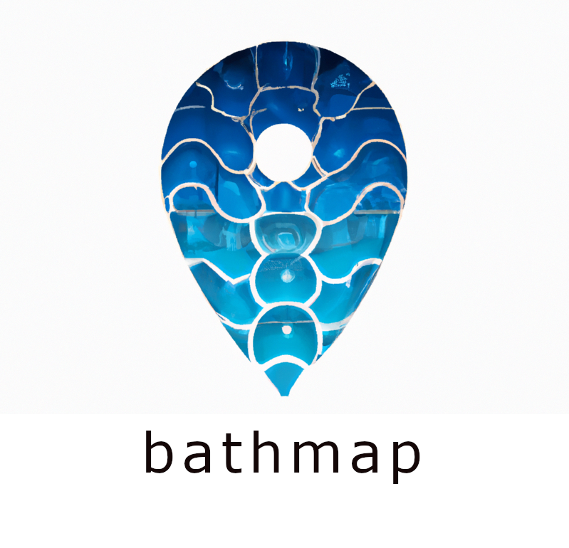

## About BathMap
BathMap is a bathymetic mapping API. We combine NOAA's bathymatric data with our technical skills to offer a developer friendly API that will allow you to integrate with NOAA's latest bathmetric data. We also provide a data viewer built using our API for users who'd like look at the maps.

- Up to date information
- Open source
- Easy interface
- Fascinating data
- Dynamic maps

## What Is Bathymetric Data?
Bathymetric data refers to information about the depth and topography of the ocean floor or other bodies of water. This type of data is gathered through the use of specialized sonar equipment, which sends out sound waves that bounce off the ocean floor and return to the surface, allowing researchers to create detailed maps of underwater terrain. Bathymetric data is used for a wide range of purposes, including charting shipping lanes and underwater hazards, mapping the locations of undersea oil and gas reserves, and understanding the geology and topography of the ocean floor. It is also important for marine conservation efforts, as it helps researchers identify areas that are particularly vulnerable to human activities and that may need protection.

To help researchers and developers access this data, the BathMap API provides high-quality bathymetric maps. The API is designed to be user-friendly, with clear documentation and easy-to-use tools for accessing and manipulating the data. By using the BathMap API, researchers can quickly and easily incorporate accurate and detailed bathymetric data into their work, helping to improve our understanding of the ocean and its ecosystems. With the help of the BathMap API, researchers and developers can access and work with bathymetric data in a more efficient and effective way.

## About The Team
BathMap is being built by the following team:
- John Meyers, Team Leader and Frontend Engineer 
- Bryan Yoder, Frontend Engineer
- Brian Bowers, Database Engineer
- Mark Schweitzer, Database Engineer
- Isaac Dugan, Backend Engineer
- Sophie Wang, Project Consultant and Salisbury University Professor
- Authur Lembo, GIS Consultant and Salisbury University Professor
