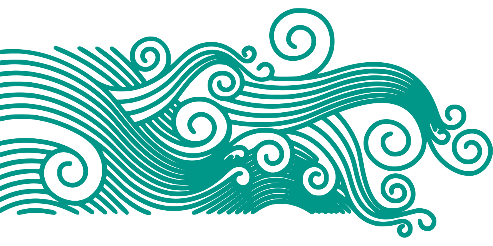

## About BathMap
BathMap is a bathymetic mapping API. We combine NOAA's bathymatric data with our technical skills to offer a developer friendly API that will allow you to integrate with NOAA's latest bathmetric data. We also provide a data viewer built using our API for users who'd like look at the maps.

- Up to date information
- Open source
- Easy interface
- Fascinating data
- Dynamic maps

## About The Team
BathMap is being built by the following team:

- [John Meyers](jmeyers5@gulls.salisbury.edu), Team Leader and Frontend Engineer 
- [Bryan Yoder](byoder1@gulls.salisbury.edu), Frontend Engineer
- [Brian Bowers](bbowers4@gulls.salisbury.edu), Database Engineer
- [Mark Schweitzer](mschweitzer1@gulls.salisbury.edu), Database Engineer
- [Isaac Dugan](idugan1@salisbury.edu), Backend Engineer
- [Sophie Wang](xswang@salisbury.edu), Project Consultant and Salisbury University Professor
- [Authur Lembo](ajlembo@salisbury.edu), GIS Consultant and Salisbury University Professor
