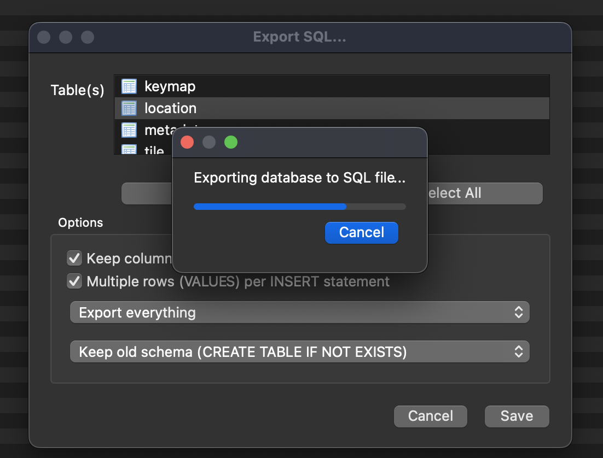

### Instructions of Using the Download Tool

There are 31 noaa provided mbtiles databases that we need to move into our databases each quarter. Each of these takes several minutes to download. This program uses Go's native goroutines which are a form of multithreading to speed up and automate the process. After installing Go (https://go.dev/doc/install), use the command `$ go run download_tool.go` to start the process.

### Instructions for Converting from SQLite to MySQL
- Use db browser to manipulate and rename table to match what we need for mysql
- This will involve renaming the table, and adding the proper GridID columns and values (transformations.sql)
- install dbBrowser
- below will need to be done twice: once for tile and once for locations
- click on file and export and select the options below

- `$ ./transform.sh export_01a.sql > import_01a.sql`
- back up production datbase
- make sure columns in mysql are in the same order as the sqlite tables
- use data import and select self contained file in mysql worbench to run our import
- look at metadata to get latt and long and insert into the grid table